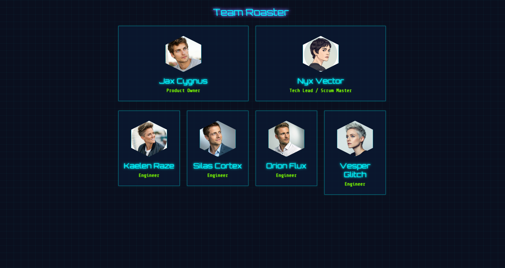

# Team Roster - Cyberpunk Edition

A dynamic, single-page application built with Vue 3 and Vite, showcasing a team roster with a futuristic, cyberpunk-inspired user interface.



## Description

This project displays a list of team members in a visually striking, animated interface. It was developed as an exercise in modern frontend practices, including component-based architecture, dynamic data rendering, and advanced CSS styling with Sass. The UI features a dark theme, glowing neon text, geometric elements, and glitch animations to create an immersive cyberpunk aesthetic.

## Features

- **Dynamic Team Roster:** Team members are rendered dynamically from a single data array, making it easy to update and manage.
- **Component-Based Architecture:** Built with Vue 3, the application is modular and scalable.
- **Cyberpunk UI:** A custom, futuristic design with:
  - Dark mode color palette.
  - Glowing neon text and borders.
  - Custom sci-fi fonts (`Orbitron`, `Share Tech Mono`).
  - Hexagonal, animated profile pictures.
  - CSS-driven glitch and stacking animations.
- **Vite-Powered:** Fast development server and optimized production builds thanks to Vite.
- **Sass Styling:** Styles are written in SCSS for more powerful and maintainable CSS.

## Tech Stack

- **Framework:** [Vue 3](https://vuejs.org/)
- **Build Tool:** [Vite](https://vitejs.dev/)
- **Styling:** [Sass (SCSS)](https://sass-lang.com/)
- **Package Manager:** [pnpm](https://pnpm.io/)

## Getting Started

To get a local copy up and running, follow these simple steps.

### Prerequisites

- [Node.js](https://nodejs.org/) (which includes npm)
- [pnpm](https://pnpm.io/installation) (recommended)

    ```sh
    npm install -g pnpm
    ```

### Installation

1. Clone the repository.
2. Navigate to the project directory:

    ```sh
    cd team-roaster
    ```

3. Install the dependencies:

    ```sh
    pnpm install
    ```

## Available Scripts

In the project directory, you can run:

- `pnpm dev`: Runs the app in development mode with hot-reloading. Open the URL provided in your terminal to view it in the browser.

- `pnpm build`: Builds the app for production to the `dist` folder. It correctly bundles Vue and optimizes it for the best performance.

- `pnpm preview`: Serves the production build from the `dist` folder locally, allowing you to preview the final app before deployment.

## Customization

### Modifying Team Members

Adding, removing, or editing team members is straightforward:

1. Open the file `src/components/TeamRoaster.vue`.
2. Locate the `teamMembers` array within the `<script setup>` block.
3. Modify the array of objects. Each object represents a team member and has the following structure:

    ```javascript
    {
      name: 'Full Name',
      title: 'Job Title',
      img: 'image-file-name.jpg', // Must be present in src/assets/images/
      styleIndex: 0 // Used for animation staggering (usually 0, 1, or 2)
    }
    ```

### Changing Styles

All visual styles, including colors, fonts, and animations, are located in `src/assets/styles/style.scss`. You can modify the CSS variables at the top of the file to easily change the color scheme.
